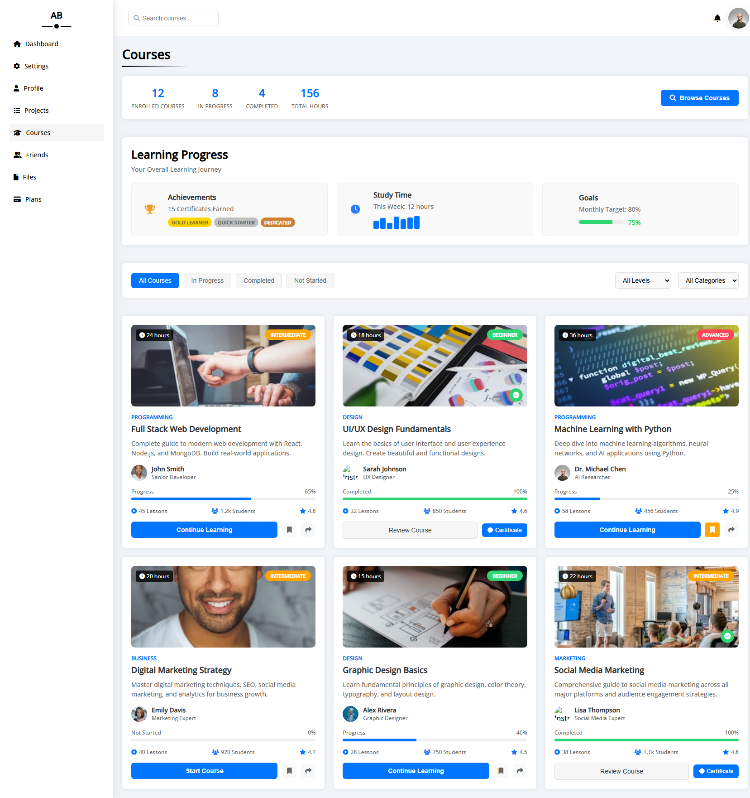
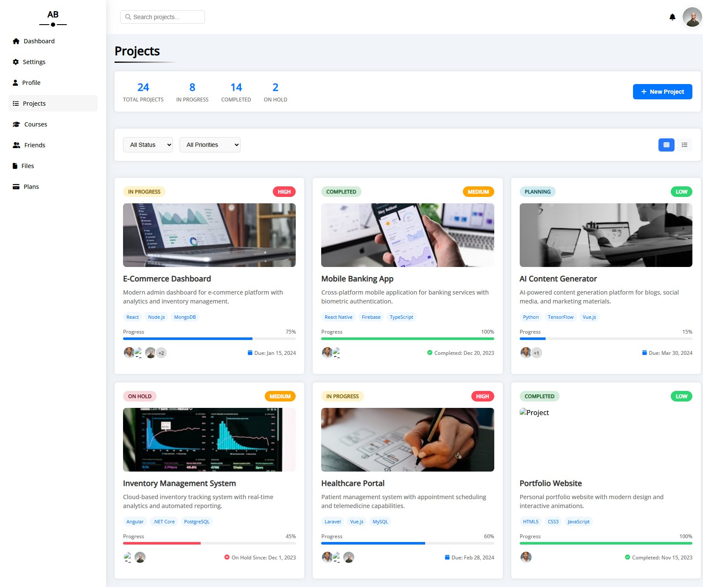
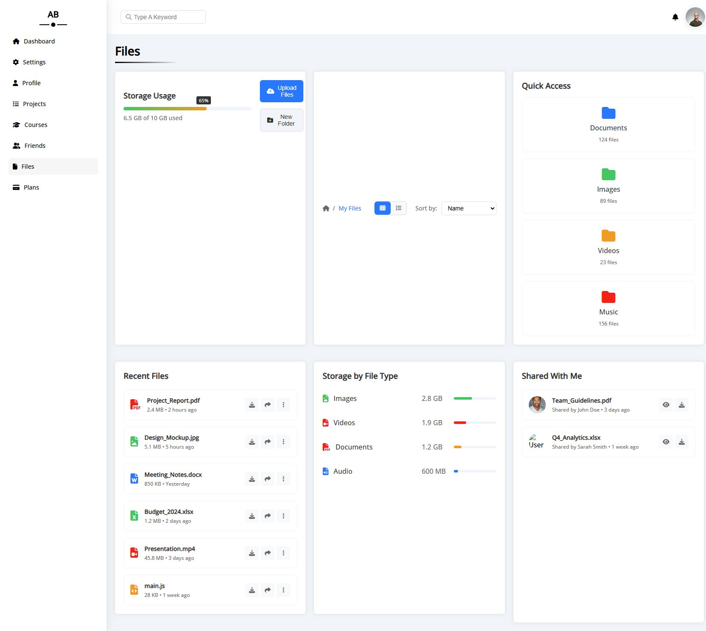
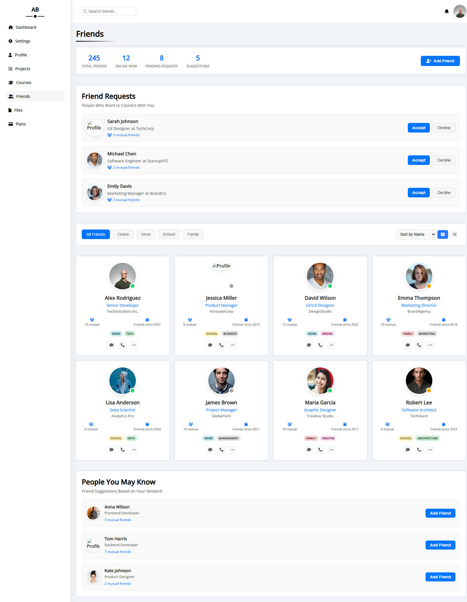
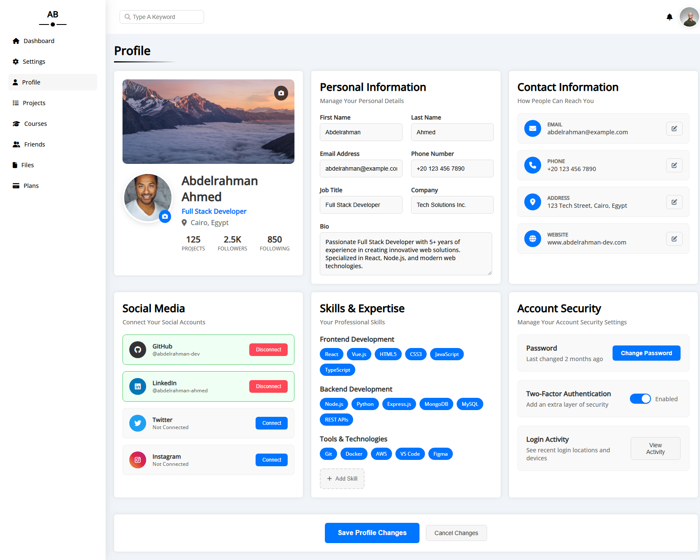
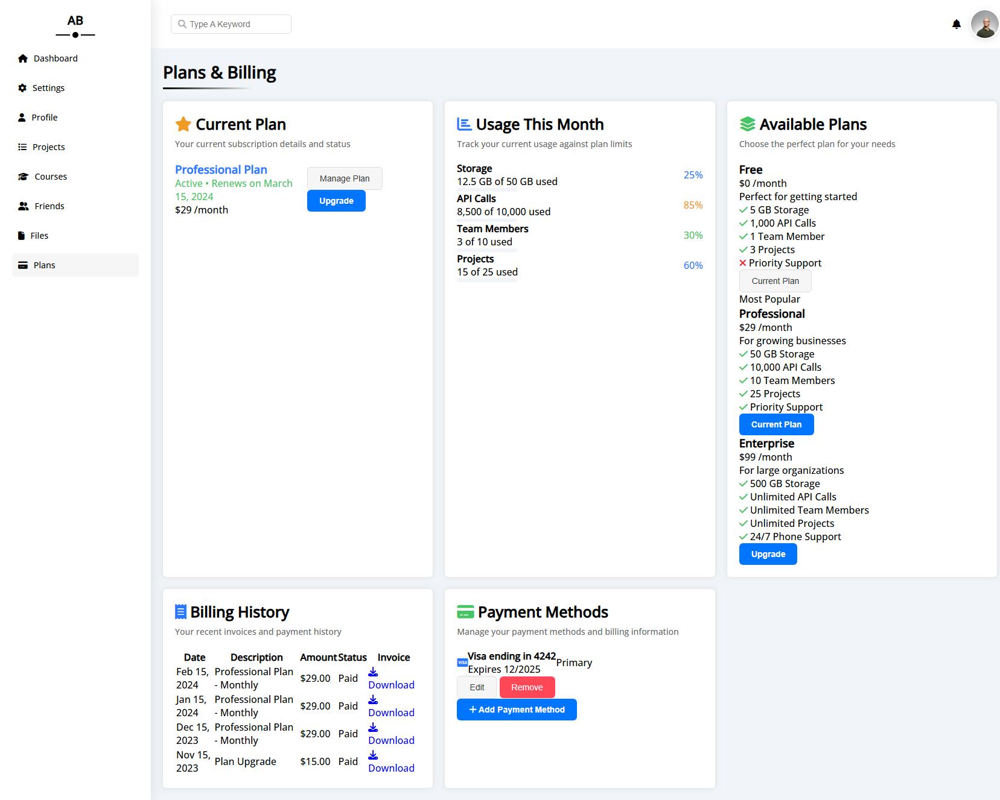
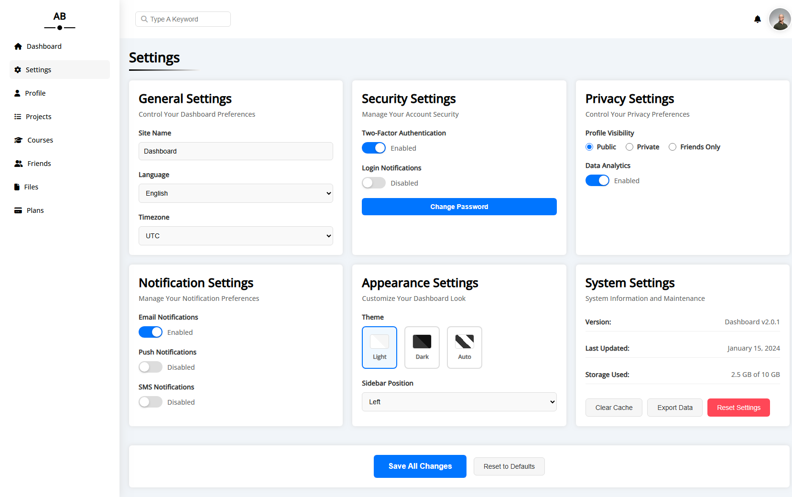

# Template Dashboard

A responsive HTML5 website template built with CSS and JavaScript.

## 🌐 Live Demo

**[View Live Demo](https://babdellghani.github.io/Template-Dashboard/)**

## 📋 Overview

This is a reusable template for building fast, modern websites. Key features include:

- ✅ Fully responsive and mobile-friendly design
- ✅ Built with HTML5, CSS3 and JavaScript
- ✅ Easily customizable with CSS variables
- ✅ Reusable components and layout built with Flexbox and Grid
- ✅ Speed optimized for performance

## 📸 Screenshots

### Dashboard Home


### Courses Page


### Projects Page


### Files Management


### Friends Page


### Profile Page


### Plans Page


### Settings Page


## 🚀 Features

- **Modern Design**: Clean and professional interface
- **Responsive Layout**: Works perfectly on all devices
- **Multiple Pages**: Dashboard, courses, projects, files, friends, profile, plans, and settings
- **CSS Grid & Flexbox**: Modern layout techniques
- **Font Awesome Icons**: Beautiful iconography
- **Customizable**: Easy to modify and extend

## 🛠️ Technologies Used

- HTML5
- CSS3 (Grid, Flexbox, CSS Variables)
- JavaScript
- Font Awesome Icons

## 📁 Project Structure

```
Template-Dashboard/
├── index.html          # Main dashboard page
├── courses.html        # Courses page
├── projects.html       # Projects page
├── files.html          # Files management
├── friends.html        # Friends page
├── profile.html        # User profile
├── plans.html          # Plans page
├── settings.html       # Settings page
├── css/
│   ├── framework.css   # CSS framework
│   ├── master.css      # Main styles
│   └── all.min.css     # Font Awesome CSS
├── webfonts/           # Font files
└── screenshots/        # Project screenshots
```

## 🎯 Getting Started

1. Clone or download this repository
2. Open `index.html` in your web browser
3. Navigate through different pages to explore the template
4. Customize the CSS and HTML to fit your needs

## 📱 Responsive Design

The template is fully responsive and tested on:
- ✅ Desktop (1920px and above)
- ✅ Laptop (1024px - 1919px)
- ✅ Tablet (768px - 1023px)
- ✅ Mobile (320px - 767px)

## 🎨 Customization

The template uses CSS variables for easy customization. You can modify colors, spacing, and other design elements by updating the CSS variables in `css/master.css`.

## 📄 License

This project is open source and available under the [MIT License](LICENSE).

## 👨‍💻 Author

Created by [babdellghani](https://github.com/babdellghani)

---

⭐ If you found this template helpful, please give it a star!
